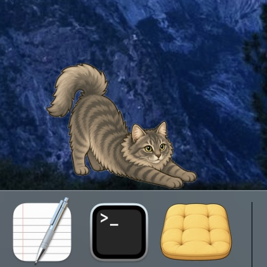
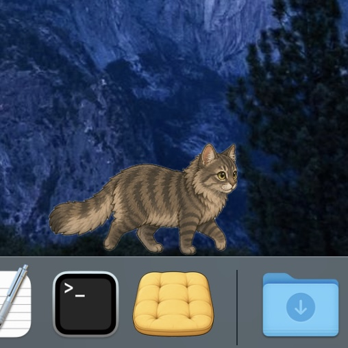
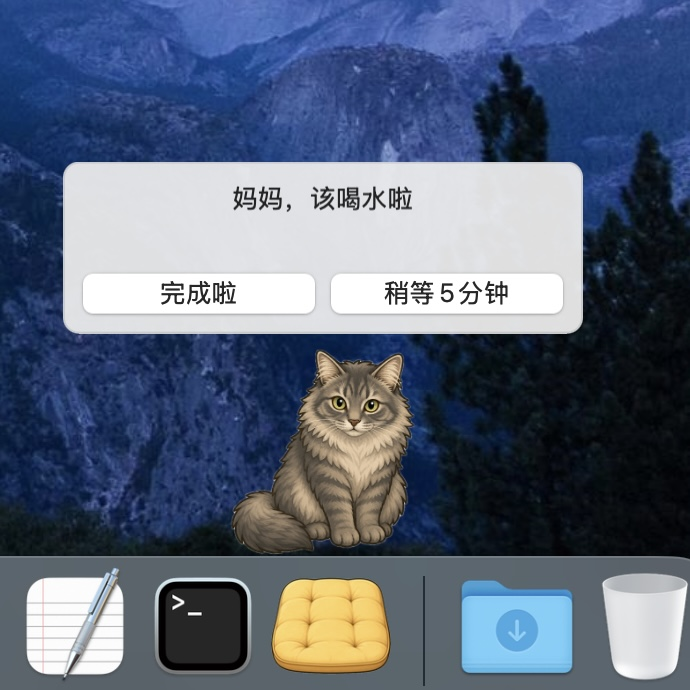

# DockCat

DockCat 是一只住在 macOS 程序坞里的桌面陪伴小猫。

它会在程序坞边休息、伸懒腰、走来走去，也会温柔地提醒你喝水、起身走走。它不追求过多互动或打扰，只想在屏幕上安静地陪你工作、学习。你可以摸摸小猫让它改变姿势，或者用鼠标把它抱到想要的位置。当你需要专注时，可以让小猫出门玩一会儿，它也许会带回来惊喜。

<table>
  <tr>
    <td align="center"></td>
    <td align="center"></td>
    <td align="center"></td>
  </tr>
  <tr>
    <td align="center">伸懒腰</td>
    <td align="center">散步</td>
    <td align="center">喝水提醒</td>
  </tr>
</table>

当前版本面向 macOS 12 及以上系统，支持 Intel Mac 和 Apple Silicon Mac。Windows 版本正在筹备中。

## 快速使用

如果你想让小猫来桌面上快速住下，推荐下载 GitHub Releases 中的 `DockCat.zip`。

1. 打开本仓库的 [Releases](https://github.com/Auwuua/DockCat/releases) 页面。
2. 下载最新版本的 `DockCat.zip`。
3. 解压后，把 `DockCat.app` 拖到“应用程序”文件夹，或放在你喜欢的位置。
4. 第一次启动时，建议右键点击 `DockCat.app`，选择“打开”，再确认打开。
5. 如果 macOS 提示无法验证开发者，请到“系统设置 > 隐私与安全性”里允许打开。

## 使用指引

- 启动 DockCat 后，会有一只小猫出现在程序坞上沿。
- 右键点击小猫或应用图标可打开菜单栏。
- 设置中可修改小猫名字、对你的称呼、显示缩放、提醒间隔、状态时长等。
- 支持自定义小猫资源包，让 DockCat 变成你自己的猫咪。

小猫会有以下状态：

- 休息：小猫保持一个姿势，如侧卧、揣手手、翻肚皮。
- 散步：小猫在程序坞上走来走去。
- 过渡：小猫短暂地伸懒腰或打哈欠。
- 抱起：用鼠标左键拖动小猫可以把它抱起来移动。
- 对话：小猫面向你对话，用于提醒模式和出门对话。
- 出门：小猫按你设定的时长出门玩，并会带回来见闻或礼物。

## 我能自定义小猫形象吗？

当然可以！这正是我们设计 DockCat 之初就想要支持的事情。

生成你想要的小猫形象：

- 我们将生成默认小猫形象的提示词分享在了 [ImageGenerationPrompts.md](ImageGenerationPrompts.md) 中，你可以直接用这些提示词搭配自家猫咪照片，用你喜欢的 AI 图片生成工具创造自己的猫咪形象。
- 你也可以以默认小猫的图片作为参照，让 AI 图片生成工具保持姿势不变、将其修改为自己想要的猫咪品种和特征，记得给出图片大小和格式要求。
- 我们推荐首先生成用于对话场景的猫咪站立形象，以清晰呈现毛色、花纹等特征。

接下来让 DockCat 加载你的小猫资源包。请阅读自定义指导 [CatCustomization.md](CatCustomization.md)。

- 要让 DockCat 在所有场景下均使用你自己的小猫形象，需要休息、散步、过渡、抱起、对话这五个状态的文件夹里各至少有一张图供加载。
- DockCat 允许加载不完整的自定义资源包来方便你预览效果，缺失或加载失败的资源类型会自动用默认小猫填充，避免屏幕上出现一只隐形猫猫。
- 同一种状态文件夹里的小猫图可以任意增加。当小猫进入任何一种非散步状态时，DockCat 会从相应文件夹的可用图片中随机抽取一张来呈现，所以你甚至可以为小猫的一种状态设计几十种样子。散步状态则会把可用的图片按顺序呈现为循环动画。

如果你在创造或加载自己的资源包时需要帮助，可以在下方的 [“支持和联系我们”](#支持和联系我们) 找到我们的联系方式。

PS: 既然任何图片都可以读了，那也不一定非得是猫了对吧 👀

## 从源码构建

如果你想自己修改小猫的行为逻辑或事件资源，可以从源码构建。

Xcode 构建命令：

```bash
git clone https://github.com/Auwuua/DockCat.git
cd DockCat
xcodebuild -project DockCatApp/DockCat.xcodeproj -scheme DockCat -configuration Debug -derivedDataPath DockCatApp/DerivedDataClean build
open DockCatApp/DerivedDataClean/Build/Products/Debug/DockCat.app
```

## 隐私和数据记录

DockCat 是完全在本地运行的桌面 App，不需要联网、不传输数据、不含广告。

它只会在你的 Mac 本地存储以下必要信息：

- 你自定义的设置项，如小猫名字、对你的称呼、提醒间隔、默认出门时间等。
- 使用统计，如陪伴时长、完成喝水/走动提醒次数、小猫出门得到的收藏品等。
- 你自定义的小猫资源包。

更新 DockCat 时，它会自动读取保存在本地的数据。如果你有自定义资源包，我们建议留好备份，这样最安全。

## 许可证

DockCat 使用 PolyForm Noncommercial License。完整条款见 [LICENSE.txt](LICENSE.txt)。简单来说：

- 你可以自由阅读、复制、修改本项目源码，构建属于自己的 DockCat 版本。
- 你不可以把 DockCat 或其修改版本用于商业用途，包括销售、收费分发、商业产品捆绑等。
- 如果你公开分发修改版本，应保留原始许可证和版权声明、提供本项目链接，并说明你的修改。

## 支持和联系我们

DockCat 仍在积极开发中，我们计划添加英文支持，并持续扩充出门结果列表。

如果你喜欢 DockCat，欢迎给本项目点星 (本页面右上角)，或[微信赞赏](README_figs/Wechat_donate.jpg)。

如果你在使用中需要帮助，或者希望以其他方式支持 DockCat，以下是我们的联系方式 (我们在北美时区)：
- 小红书：熬呜
- 微信 (如需发送文件)：Frecias

希望 DockCat 能给你想要的柔软陪伴。
